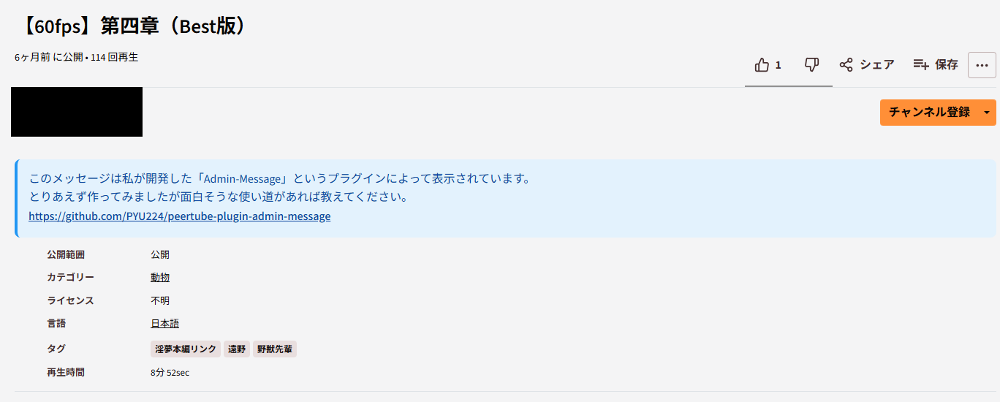

# PeerTube Admin Message Plugin

<div align="center">

<p></p>

</div>

PeerTube v7以降で動画・配信ページの説明欄下にインスタンス管理者からのメッセージを表示するプラグインです。<br>
上手い使い道はあまり思いつかないんですが、何かに使ってくれれば幸いです。

## 機能

- 🎯 動画・ライブ配信ページでの管理者メッセージ表示
- 📝 Markdown & HTML対応（サニタイズ付き）
- 🎨 6種類のメッセージスタイル（Info, Warning, Success, Error, Default, Transparent）
- 📏 3段階の文字サイズ調整（標準・大・特大）
- 📍 3種類の表示位置選択（動画下・説明欄下・コメント欄下）
- 🌙 ダークモード対応
- ⚙️ 柔軟な表示設定（動画/ライブ個別切り替え可能）

## インストール

1. PeerTubeの管理画面にアクセス
2. **プラグイン** → **プラグインを探す/インストール** へ移動
3. このプラグインをアップロードまたはNPMからインストール

## 設定

管理画面の **プラグイン** → **インストール済み** から以下の設定が可能です：

### 基本設定
- **メッセージ表示を有効化**: メッセージ表示のON/OFF
- **管理者メッセージ内容**: 表示するメッセージ内容（Markdown/HTML対応）

### スタイル設定
- **メッセージスタイル**: メッセージの見た目を選択
  - 🔵 **情報（青）**: 一般的な情報やお知らせ
  - 🟠 **警告（オレンジ）**: 注意事項やメンテナンス情報
  - 🟢 **成功（緑）**: 新機能や成功メッセージ
  - 🔴 **エラー（赤）**: 重要な警告や緊急連絡
  - ⚫ **デフォルト（グレー）**: 中性的な情報
  - ⚪ **その他（透明・無色）**: サイトのデザインに自然に溶け込むスタイル

- **文字サイズ**: メッセージの読みやすさを調整
  - **標準（16px）**: 通常の読みやすいサイズ
  - **大（18px）**: より目立たせたい場合
  - **特大（20px）**: 重要なメッセージ用

### 表示設定
- **動画ページに表示**: 通常の動画ページでの表示ON/OFF
- **ライブページに表示**: ライブ配信ページでの表示ON/OFF
- **メッセージ挿入位置**: ページ内での表示位置を選択
  - **動画のすぐ下〜説明欄の間**: 動画プレイヤーの直下
  - **説明欄の下〜コメント欄の間**: 説明文を読んだ後に目に入る位置（デフォルト）
  - **コメント欄のすぐ下**: コメントを読み終わった後

## 使用例

### シンプルなテキストメッセージ（URL自動リンク化）
```
ようこそ我々のPeerTubeインスタンスへ！

詳細はこちら: https://example.com/about
サポート: support@example.com
公式サイト: www.example.com
```

### Markdownを使用したお知らせ
```markdown
## 🔧 重要なお知らせ

**メンテナンス予定**: 2024年12月25日 2:00-4:00 JST

メンテナンス中はサービスがご利用いただけません。
詳細は [こちら](https://example.com/maintenance) をご確認ください。

ご不便をおかけして申し訳ございません。
```

### HTMLを使用した新機能案内
```html
<h3>🎉 新機能リリース</h3>
<p>新しい<strong>ライブ配信機能</strong>が追加されました！</p>
<ul>
  <li>📺 HD画質対応</li>
  <li>💬 リアルタイムチャット</li>
  <li>⏰ 配信予約機能</li>
  <li>📱 モバイル最適化</li>
</ul>
<p><a href="/help/streaming" target="_blank">配信方法の詳細はこちら</a></p>
```

### 透明スタイルでの自然な案内
```markdown
💡 **ヒント**: このビデオが気に入ったら、チャンネル登録をお忘れなく！

[サポート方法について詳しく見る](https://example.com/support)
```

### 自動リンク化の例
```
📢 最新情報をチェック！

公式サイト: https://peertube.example.com
ヘルプページ: www.example.com/help
お問い合わせ: admin@example.com

上記のURLやメールアドレスは自動的にリンクになります。
```

## スタイル別の使い分け例

| スタイル | 適用例 | 表示効果 |
|---------|--------|----------|
| **情報（青）** | お知らせ、機能説明 | 落ち着いた情報提示 |
| **警告（オレンジ）** | メンテナンス、注意事項 | 適度な注意喚起 |
| **成功（緑）** | 新機能、達成報告 | ポジティブな印象 |
| **エラー（赤）** | 緊急連絡、重要警告 | 強い注意喚起 |
| **デフォルト（グレー）** | 中性的な案内 | 控えめな情報提示 |
| **透明（無色）** | 自然な案内、ヒント | サイトデザインに溶け込み |

## セキュリティ

- **安全なHTMLサニタイゼーション**による XSS 攻撃対策
- 許可されたHTMLタグ・属性のみ使用可能
- JavaScript実行の完全ブロック
- 管理者権限でのみ設定変更可能

## 対応環境

- **PeerTube**: v7.0.0 以降
- **ブラウザ**: モダンブラウザ全般
- **レスポンシブ**: モバイル・タブレット対応

## ライセンス

AGPL-3.0 license

## サポート

問題や要望は [GitHub Issues](https://github.com/PYU224/peertube-plugin-admin-message/issues) まで。

## 変更履歴

### v1.0.18
- https://example.com や www.example.com 、 admin@example.com といったリンクを有効化

### v1.0.16
- 🎨 透明スタイル（無色透明）を追加
- 📏 文字サイズ選択機能を追加（標準・大・特大）
- 📍 メッセージ挿入位置の選択機能を追加
- 🐛 PeerTube 7.2.1 での表示問題を修正
- ✨ DOM構造の変更に対するより堅牢な対応

### v1.0.14
- 🔧 設定画面の日本語化
- 🐛 設定値取得の安定性向上
- 📱 モバイル表示の最適化

### v1.0.0
- 🚀 初回リリース
- 📝 基本的なメッセージ表示機能
- 🎨 Markdown/HTML対応
- 🌈 5種類のスタイル
- 🌙 ダークモード対応